In this post, I will create a simple command to run a workflow on Github. This will be done with help of AWS Gateway. 
AWS Gateway provides 1 million API calls per month for 12 months at the time of writing this post. 


## Setup Github 

On Github side, there is not much to setup other than adding a line to a workflow. For demonstration purposes, I will go use one of the repository from [merkez](https://github.com/merkez). 
Let's choose [insthat](https://github.com/merkez/insthat) repository for this occurence. 
When we check its existing workflow file, it looks like as follows: 

```yaml

name: Test installation script 

on:
  push:
    paths:
      - 'install-tools.sh'
  schedule:
    # 15:05 UTC > 17:05 CEST 
   - cron: '5 15 * * *'

  workflow_dispatch:

jobs:
  build:
    runs-on: ubuntu-latest

    steps:
      - uses: actions/checkout@v3

      - name: Test all functions 
        run: |
          sudo chmod +x ./install-tools.sh
          sudo bash install-tools.sh --random
```

It is, may be the simplest workflow file that you can see. After `workflow_dispatch`, we need to add `repository_dispatch`. For more about `repository_dispatch` checkout here: https://docs.github.com/en/actions/using-workflows/events-that-trigger-workflows#repository_dispatch

Let's add following lines after `workflow_dispatch`. 

```yaml
repository_dispatch:
    types: on-demand-run
```

Final workflow file: https://github.com/merkez/insthat/blob/main/.github/workflows/test-script.yml 


Generate PAT (Personal Access Token) with required permission; at least Repo option needs to be selected. 

More information about how to generate PAT can be found here: https://docs.github.com/en/authentication/keeping-your-account-and-data-secure/creating-a-personal-access-token

This is the only things to be done on Github side, nothing else. 


## Setup AWS Gateway API


Navigate to AWS Console then API Gateway and click build Rest API option from list of options you see. Afterwards select Rest and New API options as shown below. 

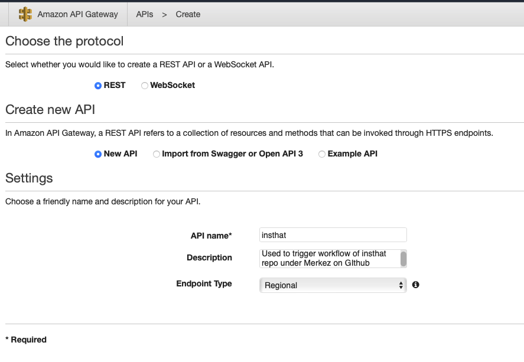

Fill out API name and description (optional) and click Create. 

In opened window, click "Create Resource" and fill out input fields according to your preference and create it. 

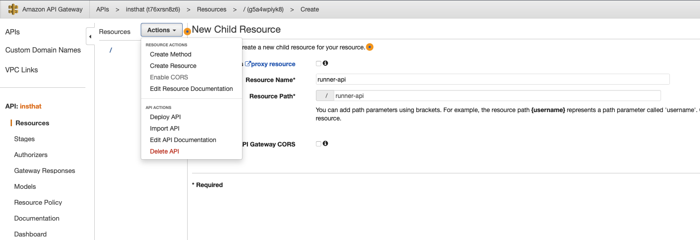

Under resource, create a POST method from Actions button again. It will open a window as given below, here select HTTP as `Integration Type` and in order to call workflow on Github, we need to construct the link. 
The template for the Github link that we will use is **https://api.github.com/repos/{owner}/{repository}/dispatches**, when we insert our values it is: **https://api.github.com/repos/merkez/insthat/dispatches**

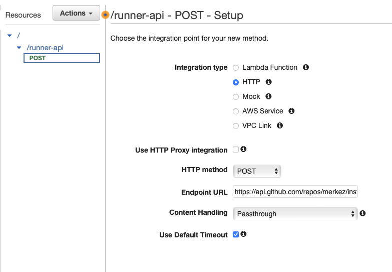

When we applied save, we should be able to see following page: 

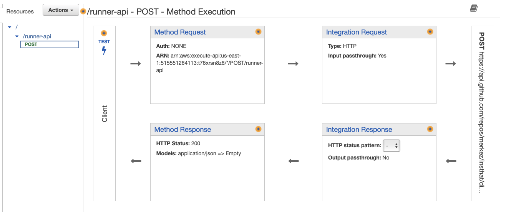


From there, navigate to Integration Request box to setup authentication keys and request body to Github. 

For authentication, following headers are required to be set. 

| **Key**       	| **Value**                         	|
|---------------	|-----------------------------------	|
| Accept        	| 'application/vnd.github.v3+json'  	|
| Authorization 	| 'Bearer {PERSONAL_ACCESS_TOKEN}'  	|
|               	|                                   	|

Adjust "Mapping Templates" section with Slack's content type, which is `application/x-www-form-urlencoded`. 


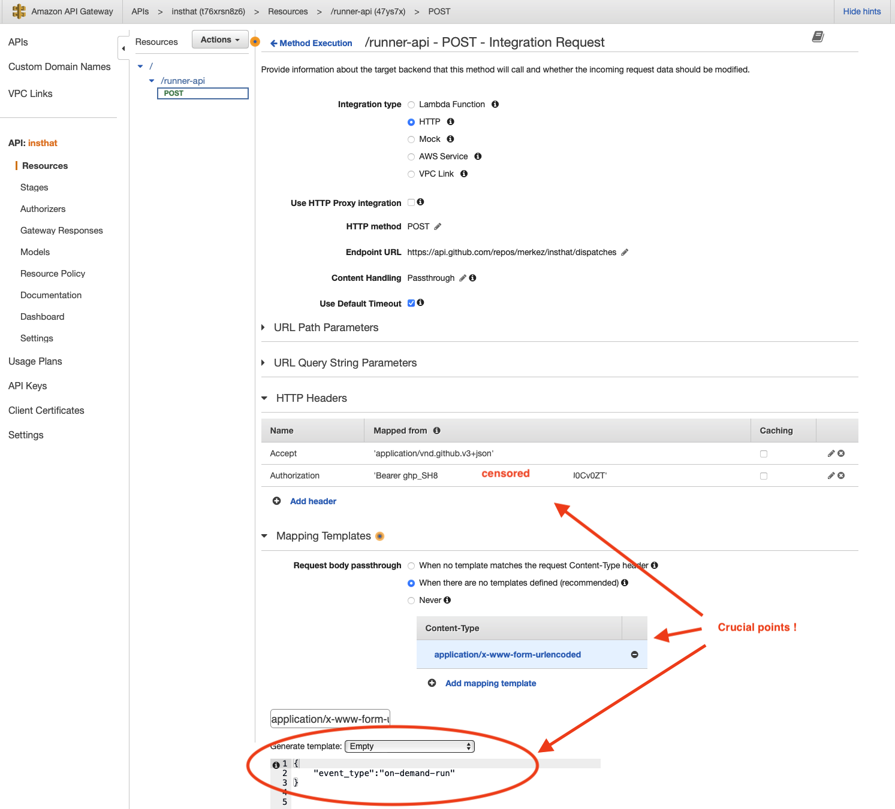


The body, `{"event_type":"on-demand-run"}` should match what you had in `repository_dispath` types. 

Lastly, deploy API on AWS Gateway. 
https://t76xrsn8z6.execute-api.us-east-1.amazonaws.com/execute-workflow

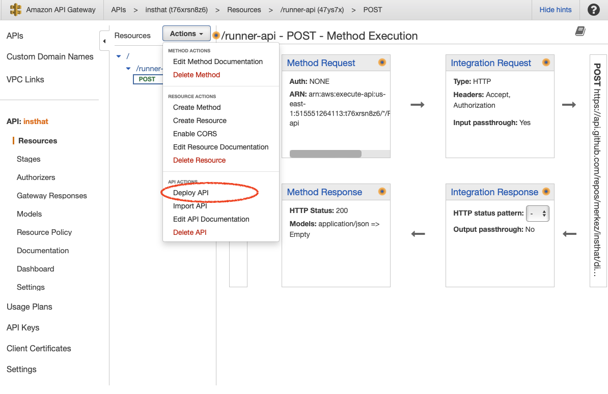

Set stage input fields. 

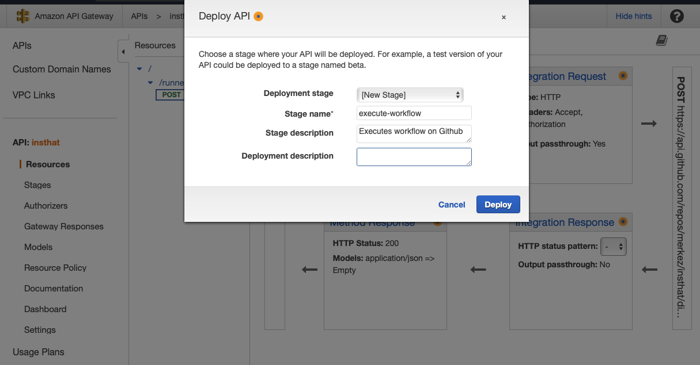

After deployment, navigate to Stages, and check full "Invoke URL" as shown below: 


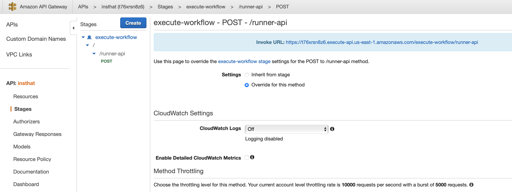

For our case Invoke URL is: https://t76xrsn8z6.execute-api.us-east-1.amazonaws.com/execute-workflow/runner-api

This URL will be used when creating the slack command. 

We can now setup Slack command and give a try through Slack. 


## Setup Slack App

In order to create slash commands, we need to create a slack application on the workspace that we have permissions. For this demonstration, I will use https://mrkzi.slack.com workspace. 

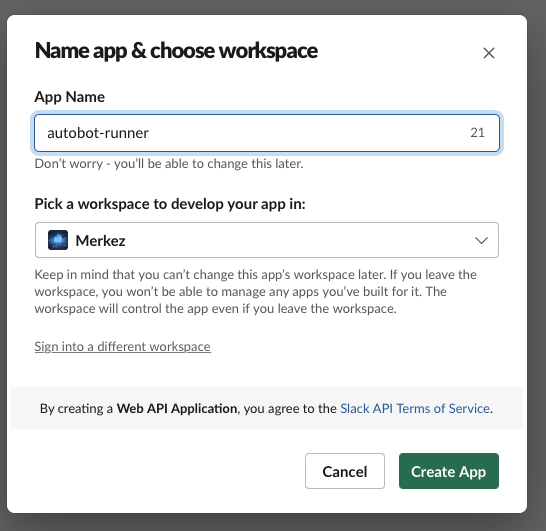

Afterwards, go to slash commands option in application page of Slack and click "Create New Command", following information will be asked. Feel free to choose any command that you want to use.
The most important section in this fields is `Request URL`, retrieve it from AWS Gateway (Invoke URL), as explained in setting up AWS Gateway step. 

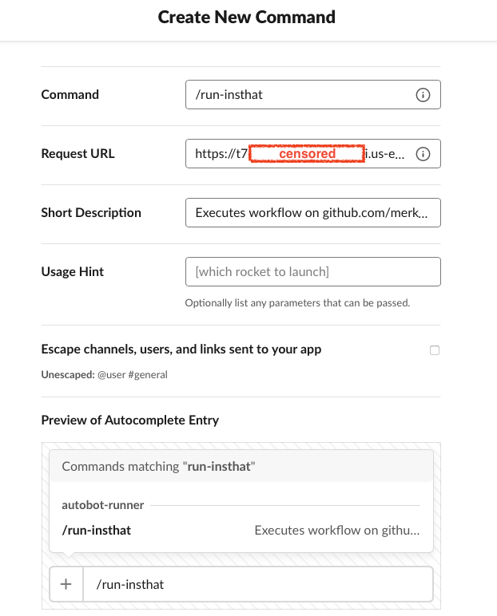


Once this is done, install the app you created to the workspace from basic information section of the app. 

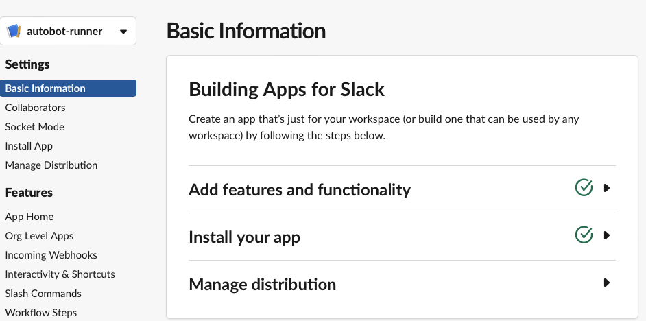


When it is done, you can go to Slack desktop application or on web, open workspace, you should be able to see `autobot-runner` or whatever you call it under apps of the workspace. 

Then, type the command you generated, for this demonstration it is, `/run-insthat`, when it is typed following option will appear. Execute it and let Github execute the workflow :) 

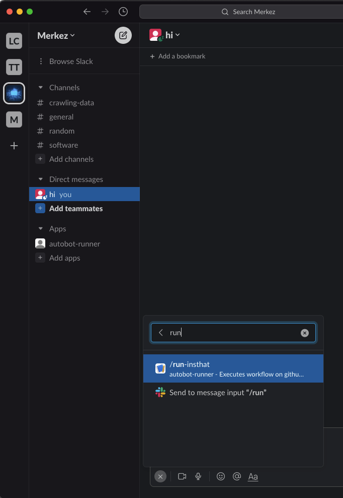

Once the command `/run-insthat` is executed on Slack, workflow will automatically run. 


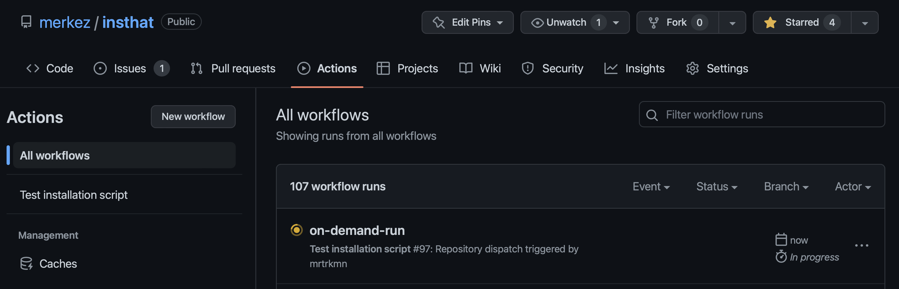

Automate the boring stuff  🤌🏻 ... 
