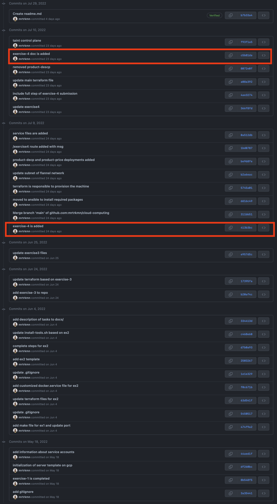

```git cherry-pick``` is a powerful subcommand of `git` extensive information can be found here: https://www.atlassian.com/git/tutorials/cherry-pick


In this mini blog post, I will demonstrate how I just used it to remove specific commits from git history and preserve rest of the information as it is. (e.g metadata, timestamps, author, committer information)

cherry-pick is generally used to remove some of the commits from git history, or re-order commit history. In this example, I will go through simple use case of it with combination of ```git filter-branch```. 

## The story

I created a private repository months ago, and consistenly filled it up with solutions of some exercises for a course at the university. However, I pushed official slide documents which I should not, luckily the repository was private and no one has an access to it. In time, I kept pushing more stuff to the repo, then we came to end of the semester. I thought that, it is better to make it public without leaking official solutions. Therefore, I had to remove the commits which are included earlier to the git history. 
The screenshot indicates which commits needs to be removed.  It is indeed easy process to complete if it is done correctly. 





### Steps to complete

1. Need to create a new branch before the document is committed to main/master branch 
    - on main/master:  

        ```bash
            git checkout -b new-main
        ```

2. All commits except highlighted ones needs to be cheery-picked.

    - cherry-pick commits, except highlighted ones : 

        ```bash 
            git cherry-pick <commit-id>
        ```

    - cherry-pick command will pick the commits that you select and append them to head of new branch. However, the problem is that it will **NOT** preserve timestamp information. It means that even though you made some commits months ago or a week ago, it will be replaced with the time that you cheerry-picked the commits. This behaviour breaks git history of a repository unexpectedly. The ideal scenario would be to have same information ( -timestamp-) as before. Therefore, there is one more additional step. 

3. Set original timestamp information on new branch for all commits. 

    - set git committer date to author date:
    
        ```bash 
        git filter-branch --env-filter 'export GIT_COMMITTER_DATE="$GIT_AUTHOR_DATE"'
        ```

Finally, you can push `new-main` branch to an upstream. 


## End result

--> https://github.com/mrtrkmn/cloud-computing/commits/main 
