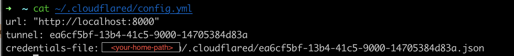

### Would like to see it in action right away ? 

Go to demonstration video here:

[](https://www.youtube.com/watch?v=Ayjk7J_KQ8A)

---
I am always amazed with Cloudflare's products, blog posts and tools that they are offering. In my spare time, I am trying to read through blog posts over here [Cloudflare Blog](https://blog.cloudflare.com/). Some of them are really easy to consume, some are not, you might need to have an idea about network related terms, or need to follow Cloudflare closely to catch on the blog posts. 

Recently, when I was surfing on Cloudflare website, I came crossed with a tool that I have seen for the first time, which is called `cloudflared`

It is a client of Argo Tunnel which is another amazing product that Cloudflare provide, including for free tiers. I will not describe or explain it in detail, since [Cloudflare Blog](https://blog.cloudflare.com/) and documentation here: [Argo Tunnel](https://www.cloudflare.com/products/tunnel/) explains it very well. Furthermore, over there, you can see and experience other cool products as well. 

Instead, in this blog post, I am going to use `cloudflared` tool, to serve a website which is locally running on my PC to the world thanks to [Cloudflare Tunnel](https://www.cloudflare.com/products/tunnel/). Since its guidelines and instructions are crystal clear,  some steps might be seen as repetitive of what Cloudflare explained. Neverthless, I would like to do it in an unofficial style anyway. 

I assume that you have hosted your custom domain at Cloudflare. Otherwise, do it as described here: [Register a new domain](https://developers.cloudflare.com/registrar/get-started/register-domain/). After installing the tool as described on official page of Cloudflared tool, you can authenticate it with the domain that you will work on. Once authentication is done, following steps can be followed.


Here is some commands which can easily be grasped at first glance. 

```bash 
# complete steps and download certificates to authenticate user and domain to use
$ cloudflared tunnel login

# create a tunnel with name mrtrkmn-tunnel
$ cloudflared tunnel create mrtrkmn-tunnel  

# serve locally running web application on local.mrturkmen.com globally
## this step is not required when you already have 
## a config file as described below
$ cloudflared tunnel --hostname local.mrturkmen.com --url http://localhost:8000 

# create a route to the tunnel over local.mrturkmen.com
# it creates a CNAME record on Cloudflare.
$ cloudflared tunnel route dns mrtrkmn-tunnel local.mrturkmen.com
# run the tunnel 
$ cloudflared tunnel run 
```

Cloudflared tool has a configuration option under your home directory, as shown here: 



I setup `localhost:8000` to be served through `mrtrkmn-tunnel (ea6cf5bf-13b4-41c5-9000-14705384d83a)`.

Different websites can be served through different tunnels by specifying newly created tunnel IDs and corresponding URLs.
For demonstration purposes, I will only consider one example. 

Total number of commands after authentication of `cloudflared` tool is five including running your local deployment.

###  Create tunnel
---
```bash 
$ cloudflared create tunnel mrtrkmn-tunnel

Tunnel credentials written to <your-home-dir>/.cloudflared/961486d1-c624-46b3-8eb5-f74ba8ab2a91.json. cloudflared chose this file based on where your origin certificate was found. Keep this file secret. To revoke these credentials, delete the tunnel.
```
### Create tunnel config 
---
```yaml
url: "http://localhost:8000"
tunnel: mrtrkmn-tunnel
credentials-file: <your-home-dir>/.cloudflared/ea6cf5bf-13b4-41c5-9000-14705384d83a.json.
```
### Route tunnel traffic to a subdomain 
---
```bash 
$ cloudflared tunnel route dns mrtrkmn-tunnel local.mrturkmen.com 
```
### Run HTTP server or a website on given port in config file
---

Just for proof of concept, run a dummy HTTP server to serve globally.

---
```bash 
$ python3 -m http.server --bind  0.0.0.0

Serving HTTP on 0.0.0.0 port 8000 (http://0.0.0.0:8000/) ...
```

### Run tunnel 

```bash 
$ cloudflared tunnel run mrtrkmn-tunnel
```

Now, you should be able to see, your local deployment or HTTP(s) server is available on given subdomain in routing step above. 

---
There are other cool stuff that Cloudflare is providing even though you have free tier account. Since I am quite interested on Cloudflare tech stack and its products, I will try to test out their products and create simple blog posts.  It is now much easy to test out your local deployments with your teammates, friends and other communities. 

--- 

### References 

- Cloudflare Tunnel, https://www.cloudflare.com/products/tunnel/
- Cloudflare Zero Trust - Get Started, https://developers.cloudflare.com/cloudflare-one/setup/
- Cloudflare Zero Trust - Add web applications, https://developers.cloudflare.com/cloudflare-one/applications/configure-apps/


