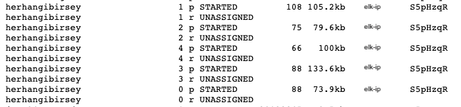

#### Giriş

Elasticsearch üzerinde büyük boyuttaki verileri hızlı bir şekilde işlemek çaba gerektiren işlerden biridir. Bu yazıda bir çalışma esnasında yapılan elasticsearch performans iyileştirmelerini ve nasıl yapıldığını anlatmaya çalışacağım.

Bu iyileştirme işlemlerinin nasıl yapıldığına geçmeden once elasticsearch mimarisinde bulunan bazı bileşenlerden bahsetmekte yarar var.

 * __Cluster__ : Elasticsearch bir veya birden fazla bilgisayarda entegre şekilde çalışabilir ve bu elasticsearch ün çalıştığı makinelere NODE denir. Cluster (Küme) ise bu node’ların oluşturduğu gruba verilen yapıya denir.
 * __Index__ : Elasticsearch üzerinde veriler indexlerde tutulur, index basit olarak dökümanların toplandığı ve tutulduğu yapıdır.
 * __Shard__: Elasticsearch ü birden fazla makine üzerinde (sanal veya fiziksel makine) tutabildiğimizden dolayı, indekslerde tutulan veriler bu cluster adı verdiğimiz ortamlarda dağıtık (distributed) şekilde tutulur. Bu işlemin yönetim kısmını elasticsearch otomatik olarak halleder.
 * __Replica__: Elasticsearch normalde (default) her indeks için 5 ana shard ve 1 replica oluşturur, yani her bir indeks 5 adet shard’a sahip ve her shard bir replica içermektedir.  Aşağıda bu durumu gösteren bir ekran görüntüsü verilmiştir.

```bash
http://<elk-ip>:9200/_cat/shards
```




Bu performans iyileştirme adımları, tek sunucu (node) üzerinde çalışan Elasticsearch üzerinde yapılmıştır, yani dağıtık bir sistem üzerinde iyileştirme yapmak buradaki anlatılacaklardan farklı olacaktır. (Bazı kısımları benzerlik gösterse dahi)

<ins>__Not : Bu iyileştirme işlemleri, çalıştırılan sunucu sayısına (dağıtık sistem ise), internet hızına (dağıtık sistem ise), sunucuda çalışan işletim sisteminden, kullandığı disk, CPU ve RAM kapasitesine göre değişiklik gösterebilir.__<ins>


#### Paralel Bulk indeksleme

Elasticsearch üzerinde indeksleme işlemi birkaç farklı yöntem ile yapılabilmektedir bunlardan bazıları, tek tek indeksleme, bulk indeksleme ve parallel indekslemedir.

Tek tek indeksleme yöntemi, tahmin edeceğiniz üzere veri büyük olduğunda tercih edilecek bir yöntem değildir, nedeni ise her kayıt için elasticsearche istekte bulunmasından dolayıdır. Yani 10000 adet satır için 10000 istek gönderilecek demektir, bunun yerine bulk indeksleme tercih edilir 10000 adet kayıt için tek istek gönderimi yapar böylece hem istek sayısı minimuma indirilmiş olur, hem de indeksleme süresi azaltılmış olur. Bunun bir adım daha gelişmişi ise paralel bulk tır, bu indeksleme yönteminde ise birden fazla thread ile veri elasticsearche gönderilecektir sağlar. Bizim çalışmamızda paralel bulk işlemi kullanılmıştır.

Bu çalışmada, Elasticsearch ün Python modülleri kullanılmıştır, bu modülde paralel bulk kullanımı aşağıdaki şekildedir.

Paralel bulk kullanabilmek için Python generator kullanmak tercih edilen yöntemlerden biridir, nedeni hem ram kullanımı az olur, hemde tekrarlı  (iterate) bir yapıya sahiptir. 

Örnek generator yapısı : 

```python
def gendata(docs_list):

     for json in docs_list:

        yield {
            "_index": "herhangibirsey",
            "_type": "_doc",
            "isim":json['isim'],
            "soyisim":json['soyisim'],
            "sehir": json['sehir'],
            "yas":json['yas'],
            "meslek":json['meslek']
        }

```


 Bu generator yapısında, gendata fonksiyonu docs_list adında bir liste alıyor ve bu listenin içeriği şu şekilde olduğunu varsayıyoruz: 

```python

docs_list= [{"isim": "Mehmet","soyisim": "Ataklar","sehir": "Kocaeli","yas": 45,"meslek": "Ogretmen"}]

```

 `gendata` fonksiyonu `docs_list` listesi icerisindeki her bir dokumandan gereken alanlari alarak indeksleme fonksiyonuna vermektedir. Parallel bulk, Python script üzerinden şu şekilde çağrılabilir.

```python
 for response in parallel_bulk(elasticDeamon, gendata(doc_records), thread_count=7):
    pass 
```


#### Indeks yenileme aralığını kaldırma (refresh_interval)

Node üzerinde bulunan indeks e, bulk indexleme işlemi yapılırken, indeks yenileme aralığı bulk indeksleme süresi boyunca ortadan kaldırılmalıdır. Çünkü elasticsearch ün her yenileme yapması sunucu üzerinde segment oluşturmasını sağlamaktadır, bu hem makinen kaynaklarına dezavantaj olarak yansımaktadır, ram ve cpu kullanımını artıran pahalı bir işlemdir.

Kibana üzerinde bulunan “Dev Tools”   kısmından aşağıdaki verilen komut ile kaldırılabilir.

```bash 
    PUT /<indeks-ismi>/_settings

    {
        "index": {

            "refresh_interval": -1

        }

    }
```

Terminal üzerinden: 


```bash 
curl -X PUT "<elk-ip>:9200/<index-ismi>/_settings" -H 'Content-Type: application/json' -d' { "index" : { "refresh_interval" : -1 } } '

```

Bulk indeksleme işlemi sona erdiğinde ise, aynı komutlar kullanılarak, yenileme aralığı “null” a eşitlenebilir. Böylece kullanıcı kibana üzerinden, yenileme aralığını kendisi ayarlayabilir. 

```bash 
PUT /<index-ismi>/_settings

{

    "index": {

        "refresh_interval": null


    }

}
```

####  Indeks kopyalarını devre dışı bırakmak (Replica)

Kulağa hoş gelmesede indeks kopyalarını (replicas) devre dışı bırakmak indeksleme hızını artırır, en büyük dezavantajı indeksi herhangi bir hata durumunda veri kaybına karşı savunmasız bırakır.  

Kibana “DevTools” kısmından kopyaların devre dışı bırakılması.

```bash 
PUT /<indeks-ismi>/_settings

{

    "index" : {

        "number_of_replicas" : 0

    }

}

```

Terminal üzerinden: 

```bash 
curl -X PUT "<elk-ip>:9200/<index-ismi>/_settings" -H 'Content-Type: application/json' -d' { "index" : { "number_of_replicas" : 0 } } '
```


#### Swap alanını kaldırmak. (Sunucu üzerindeki)

Elasticsearchü hızlı yapan faktörlerden en önemlisi ram üzerinden işlem yapmasıdır. Linux sunucularında bulunan swap alanı, ram de yeterli alan kalmadığında veya ram üzerinde uzun süre işlem yapılmayan (aktif olmayan) dosyaların disk üzerinde kısa süreliğine saklanmasından oluşan alandır. Bu elasticsearh için dezavantaj olabilmektedir, elasticsearchün tamamen ram üzerinden işlem yapmasını sağlamak adına swap alanını kaldırmak indeksleme ve arama yapma hızını artıracaktır.

Swap alanını geçici olarak şu şekilde kaldırabilirsiniz,  terminal üzerinden bu komutu yazmanız yeterlidir. 

```bash 
$ swapoff -a
```

Swap alanını tamamen kaldırabilmek için “root” yetkisi ile `/etc/fstab` dosyası içerisinde `swap` kelimesi geçen kısmı yorum satırı yapmanız yeterli olacaktır.

Swap alanını ortadan kaldırdıktan sonra sunucu üzerinde çalışan elasticsearch ayarlarında ufak bir değişiklik yapmak gerekecektir. 

`/etc/elasticsearch/elasticsearch.yml`

`elasticsearch.yml` dosyası içerisine şu parametreyi eklemeniz gerekmektedir. 

```yaml 
bootstrap.mlockall: true 
```

Bu işlem elasticsearch ün tamamen RAM üzerinden işlem yapmasını sağlayacaktır. 

#### JVM Heap Alanını Artırmak

Elasticsearch JVM heap, verileri hızlı bir şekilde işlemek ve veriler üzerindeki işlemleri yapabilmek için elasticsearche özel olarak ayrılmış bir alan. Bu alan normalde (default olarak) 1 GB alana sahiptir, eğer sunucu üzerinde yeterli miktarda RAM mevcut ise bu alanı artırmak indeksleme ve işlem yapma hızını artıracaktır.

Burada önemli olan JVM Heap alanı 64 Bit yapıya sahip bir sunucu için __*maksimum*__ 32 GB a kadar artırılmalıdır, sunucu üzerinde çok daha fazla RAM olsa dahi 32 GB limiti geçmemek gerekmektedir. Bununla ilgili detaylı açıklamaya buradan erişebilirsiniz: https://www.elastic.co/guide/en/elasticsearch/guide/current/heap-sizing.html

JVM Heap  alanı ayarlanırken genellikle fiziksel ram boyutunun yarısı kadar heap alanı vermek tercih edilir, 32 GB boyutunu geçmeyecek şekilde.

JVM Heap ayarları şu şekilde yapılabilir, Debian tabanlı bir işletim sisteminde elasticsearch ün bulunduğu dizin altında __jvm.options__ adında bir dosya bulunmaktadır.

Eğer heap alanını 16 GB ayarlamak isterseniz(fiziksel RAM in en az 32 GB olduğundan emin olunuz ),  jvm.options dosyası içerisine şu şekilde kaydedebilirsiniz. 

```raw

/etc/elasticsearch/jvm.options

    ## bu jvm.options dosyası içerisine aşağıda verilen parametler girilir.

-Xms16GB
-Xmx16GB  

```

Bu parametreler, `jvm.options` dosyası içerisine kaydedildikten sonraki adımda ise elasticsearch servisini yeniden başlatmayı unutmayınız. 

```bash 
sudo service elasticsearch restart
```

#### SSD veya RAID 0 disk kullanımı 

HDD disklere göre çok hızlı olan SSD diskler, elasticsearch ün veriyi daha hızlı işlemesine, verimliliği artırmasına direkt olarak etki edecektir. RAID diskleri kullanırken RAID 0 haricindeki tiplerini kullanmak tercih edilmez.  

Bu kısımda elasticsearch performansını artırmak için yapılması gerekli olabilecek bazı adımlardan bahsedildi bunlar özet olarak. 

- *Paralel bulk indekslemek*
- *JVM heap alanı artırmak*
- *İndeks kopyaları devre dışı bırakmak*
- *İndeks yenileme aralığını devre dışı bırakmak*
- *Sunucu Swap alanını kaldırmak*
- *SSD veya RAID 0 Disk Kullanmak*

Bu, elasticsearch performans iyileştirme adımlarını gösteren birinci kısım, ikinci kısımda, elasticsearch üzerinde indeks oluştururken, mapping sisteminin verimize göre nasıl yapılandırılması gerektiğinden, indeks üzerinde otomatik olarak oluşturulan bazı alanların kaldırılmasından, optimum shard sayısının belirlenmesinden, indeks performans (benchmarking) ölçümlerinden  ve Grafana üzerinden elasticsearch değerlerinin  (CPU,I/O, RAM, DISK kullanımının) izlenmesi anlatılacaktır. 

#### Bu çalışma esnasında yararlanılan kaynaklar

<a href="https://blog.codecentric.de/en/2014/05/elasticsearch-indexing-performance-cheatsheet">https://blog.codecentric.de/en/2014/05/elasticsearch-indexing-performance-cheatsheet></a>

<a href="https://www.elastic.co/guide/en/elasticsearch/reference/master/tune-for-indexing-speed.html">https://www.elastic.co/guide/en/elasticsearch/reference/master/tune-for-indexing-speed.html</a>

<a href="https://www.elastic.co/guide/en/elasticsearch/guide/current/heap-sizing.htm">https://www.elastic.co/guide/en/elasticsearch/guide/current/heap-sizing.htm</a>

<a href="https://elasticsearch-py.readthedocs.io/en/master">https://elasticsearch-py.readthedocs.io/en/master</a>
