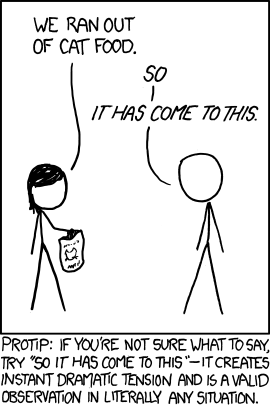

It was another interview that I had with a company, and I was asked about metaclasses in Python. Up to now, I did not have a requirement to use them, it leads to have a superficial idea about them but not exactly know what they are, therefore decided to do some research and write a short blog post about them.

## What are metaclasses?

In Python, everything is an object. Classes are objects too. Metaclasses are classes that create classes or customize class creation. We can say that metaclasses are the "stuff" that creates classes.

You define classes in order to create objects, right? But we learned that Python classes are objects. Well, metaclasses are what create these objects. They are the classes' classes, you can picture them this way:

```python
class MetaLogger(type):
    def __new__(cls, name, bases, attrs):
        # Add logging functionality to all methods in the class
        for attr_name, attr_value in attrs.items():
            if callable(attr_value):
                # Wrap the method with logging
                attrs[attr_name] = cls.add_logging(attr_value)
        return super().__new__(cls, name, bases, attrs)

    @staticmethod
    def add_logging(func):
        def wrapper(*args, **kwargs):
            print(f"Calling method: {func.__name__}")
            return func(*args, **kwargs)
        return wrapper


class MyClass(metaclass=MetaLogger):
    def foo(self):
        print("Executing foo method.")

    def bar(self):
        print("Executing bar method.")


# Create an instance of MyClass
obj = MyClass()

# Call methods on the instance
obj.foo()
obj.bar()

```

In the given piece of code, we have a metaclass called `MetaLogger` that wraps all methods of the class with logging functionality. We can see that we have a class called `MyClass` that uses `MetaLogger` as a metaclass. When we create an instance of `MyClass`, we can see that all methods are wrapped with logging functionality. For example, when we call `obj.foo()`, we can see that the method is wrapped with logging functionality.

Imagine that you define a generic logger metaclass that adds logging functionality to all methods of the class. You can use this metaclass in all classes that you want to add logging functionality to all methods. This is only one example of the power of metaclasses.

The output of the above code is:

```bash
Calling method: foo
Executing foo method.
Calling method: bar
Executing bar method.
```

## Create classes on the fly 

Metaclasses can be used to create classes on the fly. For example, you can create a class on the fly that has a method that returns the current time. Here is an example:

```python
import datetime

class TimeGetter(type):
    def __new__(cls, name, bases, attrs):
        attrs['get_current_time'] = lambda self: datetime.datetime.now()
        return super().__new__(cls, name, bases, attrs)

# Create a class dynamically using the TimeGetter metaclass
DynamicClass = TimeGetter('DynamicClass', (), {})

# Create an instance of the dynamically created class
obj = DynamicClass()

# Call the method to get the current time
current_time = obj.get_current_time()

# Print the current time
print("Current Time:", current_time)

```

In the given piece of code, we have a metaclass called `TimeGetter` that adds a method called `get_current_time` to the class. We can see that we create a class called `DynamicClass` dynamically using the `TimeGetter` metaclass. When we create an instance of `DynamicClass`, we can see that we have a method called `get_current_time` that returns the current time. 

The output of the above code is ( time will be different of course):

```bash
Current Time: 2023-06-18 12:20:00.000000
```

The power of metaclasses is astonishing. You can create classes on the fly, you can add functionality to all methods of a class, you can do many things with metaclasses. Although metaclasses are powerful, they are not used very often. You can use metaclasses to create following features with a super effective way;

 -  DSL (Domain Specific Language) 
 -  a framework
 -  a plugin system 
 -  a database ORM (Object Relational Mapper)
 - serialization/deserialization system
 - a caching system
 - a validation system  

 These are only a few examples of what you can do with metaclasses. Try to use them in your projects, you will see that they are very powerful.

## Conclusion

Python is like an ocean and you can learn new things every day. Metaclasses are one of the most powerful features of Python. I have tried to give general information and few examples of metaclasses. However, there are many great, extensive and well written articles about metaclasses. I recommend you to read them. First and foremost, I recommend you to read the [official documentation](https://docs.python.org/3/reference/datamodel.html#metaclasses).
As a second or this could also be first step as well, I strongly recommend you to read the following articles to get more depth knowledge about metaclasses:
    
- [What are metaclasses in Python?](https://stackoverflow.com/questions/100003/what-is-a-metaclass-in-python)
- [Metaclasses in 500 lines of code](https://blog.ionelmc.ro/2015/02/09/understanding-python-metaclasses/)

I hope, you learnt something new today. 



## References

- [Official Documentation](https://docs.python.org/3/reference/datamodel.html#metaclasses)
- [What are metaclasses in Python?](https://stackoverflow.com/questions/100003/what-is-a-metaclass-in-python)
- [Metaclasses in 500 lines of code](https://blog.ionelmc.ro/2015/02/09/understanding-python-metaclasses/)
- And [ChatGPT](https://openai.com) of course :)
