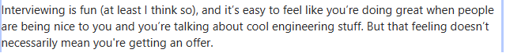
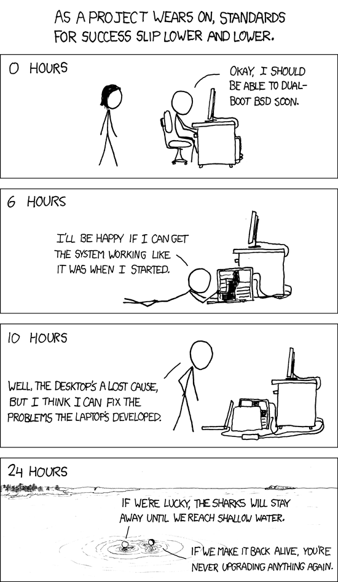

What I like about interviews is that they can directly show your weaknesses to you. When you think about a friend, girlfriend, parents and even your teacher, they all might say that you are great at what you do even though you are not. Well, maybe you are really good at what you do but hearing it from someone who has objective views on you is very effective. It is all about trade offs. Here, objective views refer to  from the perspective of conducting interviews to you, it will not be fair to have your closest friend as interviewer. All judgment is done based on your technical skills rather than personal thoughts. Sure, you do not want to hear bad judgments from your close friends, girlfriend or parents. However you might still want to see your value in industry independently from what your friends, parents think about. Therefore, I started interviewing with companies to find my weaknesses and desired job.

I have been rejected by many companies even before the screening, and an automated message appears at your inbox daily :) At the beginning, you feel upset, but once you see the general situation, you start to get used to it. I mean, there are some ridiculous job advertisements which request more than six years of experience on certain technologies but recruiting you as an intern. Despite all these scenarios, it is still not easy to get to the first stage. Nevertheless, I had some full time position interviews in the past. At least four of them took around 5-6 hours of technical interview with different people each hour. The last one was not an exception, it took seven hours, and I am glad to have this interview regardless of its result. 

I recently had an  interview at one of the MAANG companies. I can say that I really liked the process, all the people in the interview were so nice. Due to the time difference, it was a little bit difficult to arrange interview hours but it was managed thanks to their understanding and effort.  It provided me with lots of “aha” moments, I understood my existing strengths and weaknesses even though it was painful. I had a chance to meet and talk with great people, in particular with ones who worked on a topic which is close to my master thesis topic. After hours of interviews and waiting for the result, I have been rejected for the position. Of course, there might be many reasons behind the rejection, I can easily think and to be honest the first thing comes to mind,  being not good enough. It might be true actually, even though it might be difficult to accept, however it might not be true as well. The trick I guess, keep continuing to apply and get interviews then eventually you will see whether it is true or not. 

Except for the unexpected, I have seen a discussion on quota and I would like to quote an argument from there, I totally agree on this argument. 

The last interview was composed of all areas in computer science; architecturing, system design, programming, multi-thread programming, however at each step, there was live coding. People are thinking with you on live coding and trying to help you to understand the concept as well as they try to understand how you think. Attitudes of the people were always positive, at least in my experiences. The small details matter when it comes to detailing a concept, programming or understanding the question. Understanding the process of what actually has been asked can be fastened by practicing the questions on leetcode, hackerrank, and other similar websites. Watching videos on Youtube about some concepts is beneficial however they do not really assist you in detailing a concept, at least for me. Technical books, Designing Data-Intensive Applications: The Big Ideas Behind Reliable, Scalable, and Maintainable Systems, System Design Interview – An insider's guide, Software Architecture: The Hard Parts and many more technical books provide theories behind certain technologies, more details which are asked in the interviews. Therefore, keeping a habit of reading them proactively while practicing on the coding questions websites ( leetcode, hackerrank) will provide all necessary knowledge. I missed some parts due to time constraints that I have at the moment ( -finishing up master thesis, studying, working, etc- ), however I will be back on track after some time.  And at the end, a  company will try to choose the person who is the best fit for the role :) 

The outcomes from the failures that I experienced; invest in education,  keep trying, work, work, work, no easy solution.

- Keep reading technical blogs and books 
- Practicing coding exercises ( even though for some cases this is not that critical) 
- Review code, check on popular Github repositories 
- Understand the details, focus on small points
- Try to implement the theory that you have learned during your studies
- Try to understand huge architectures by dividing the components
- Reading should be careful, not just checking out, focusing on something which looks easy might make it harder to understand
- Explain your learnings to someone who has no idea about what you are talking about, if they are just smiling, but no questions asked, then most probably you failed to explain, they are just acting nicely to you :)  
- Apply to the jobs which are relevant to you, do not apply blindly and expect to have returns.
- When you have a rejection after long hours of interviews, do a post-mortem :) and focus the outcome of the post-mortem,  then keep learning, applying and trying 

Good luck ! 

