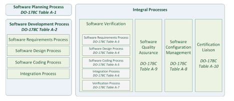
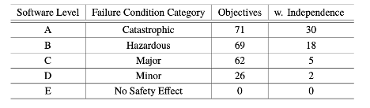

Have you heard of it ?  If not, you are not the only one, who did not heard such a field until now.

Software development should not only focus on development of the software. In those cases, numerous problems will occur eventually, it might resemble addressing the manifestations of a severe ailment without delving into its underlying source.

There are some standardizations and certifications which are pointing out main requirements and features of these kind of software systems. I started to learn about this in the aerospace domain, for instance DO-178 safety standard is one of them. Even though DO-178 standard published in 1984, it has been regularly updated in 1985 and 2011.

In the book of “A Practical Guide for Aviation Software and 00-178C Compliance”, it is mentioned that there are five key factors which must be thoroughly and constantly addressed while developing safety-critical software.

- Well-documented systems architecture and requirements definition
  - System requirements should be validated for correctness and completeness.
- Solid safety practices at all levels of development.
- Disciplined implementation
  - Well-defined change management system
  - Requirements and safety attributes must be accurately implemented.
  - No unintended functionality is added.

- Well-qualified personnel
  - Commitment to excellence
  - perfectionists who strive for 100% on every task.
- Thorough testing at all levels

Back to the standardization DO-178, it defines five levels A to E. Level A is where no objectives have to be met, and from E to A it increases objectives, eventually Level A has to met all objectives. When DO-178C is checked focus area is mainly lifecycle of processes; software planning, software development, software verification, software quality assurance, software configuration management and certification liaison.
In the industry, applying all the steps takes tremendous amount of time at the end, despite of developing and completing it. There is still too much bureaucratic steps to apply in order to have certification for the software which is developed under the standardization.

The Table 1 shows, overview of DO-178C processes and sub-processes.

As it is mentioned earlier, there are levels from A to E, and they are categorizes with their failure condition category, number of objectives and w. independence.

In the end, it is a very challenging and time-consuming process to develop software under DO-178C standardization. However, it is a must for the safety-critical software development in the aerospace domain.

To expand objectives and provide more detail, I can provide following table:

| DO-178C Level | Objectives                                     | Methodology                 | Tools                                             |
|---------------|-----------------------------------------------|-----------------------------|---------------------------------------------------|
| Level A       | Ensure no software error results in catastrophic failure | Formal Methods              | Model Checking Tools (e.g., SPIN, NuSMV, Alloy)  |
|               |                                               |                             | Automated Requirement Traceability Tools           |
| Level B       | Ensure errors don't cause catastrophic failure, but may lead to hazardous/major failures | Design Reviews              | Design Review Tools (e.g., IBM Rhapsody)         |
|               |                                               |                             | Configuration Management Tools (e.g., Git)       |
| Level C       | Ensure errors don't cause hazardous conditions, but may lead to major failures | Testing                     | Unit Testing Frameworks (e.g., JUnit, Google Test)|
|               |                                               |                             | Code Coverage Tools (e.g., BullseyeCoverage)     |
| Level D       | Ensure errors don't cause major failures, but may lead to minor failures | Requirements Management     | Requirements Management Tools (e.g., IBM DOORS)  |
|               |                                               |                             | Formal Methods Tools (e.g., SPARK, CodePeer)     |
| Level E       | Ensure errors don't affect aircraft operation, controllability, or flight safety | Design Reviews              | Model-Based Design Tools (e.g., Simulink)        |
|               |                                               |                             | Safety Analysis Tools (e.g., FTA, FMEA software) |

The journey through the levels of DO-178C certification illuminates the symbiotic relationship between safety and security in airborne software development. There are still many detailed points to consider and work on however to keep the post short, cutting here might be nice for informative part.

The aviation industry constitutes a realm of unparalleled complexity, innovation, and global connectivity, embodying a whole new world of exploration and advancement.

As baby steps, I started to learn and wanted to put what I read and summarized, here, this might not be interesting information for all however it is just a note to myself.

Oh, before forgetting, military and civil aviation industries have completely different procedures and approaches to develop an aircraft. Indeed, there are some common points where both should obey, for instance flight operations in for military based aircrafts are often conducted in dynamic and potentially hostile environments. In civil aviation industry, flight operations are typically conducted in a more predictable and controlled environment. There are many other points which they differ a lot, but it is obvious.

References:

- A Practical Guide for Aviation Software and DO-178C Compliance, by Leanna Rierson
- Christoph Torens. "Safety Versus Security in Aviation, Comparing DO-178C with Security Standards," AIAA 2020-0242. AIAA Scitech 2020 Forum. January 2020.
