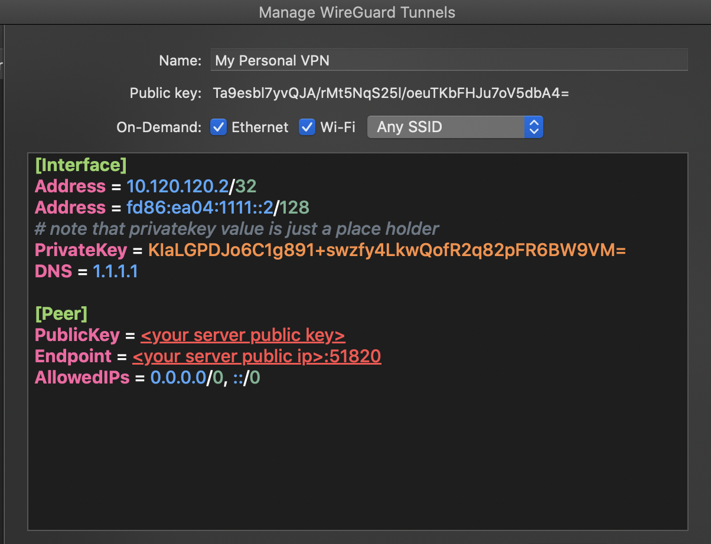
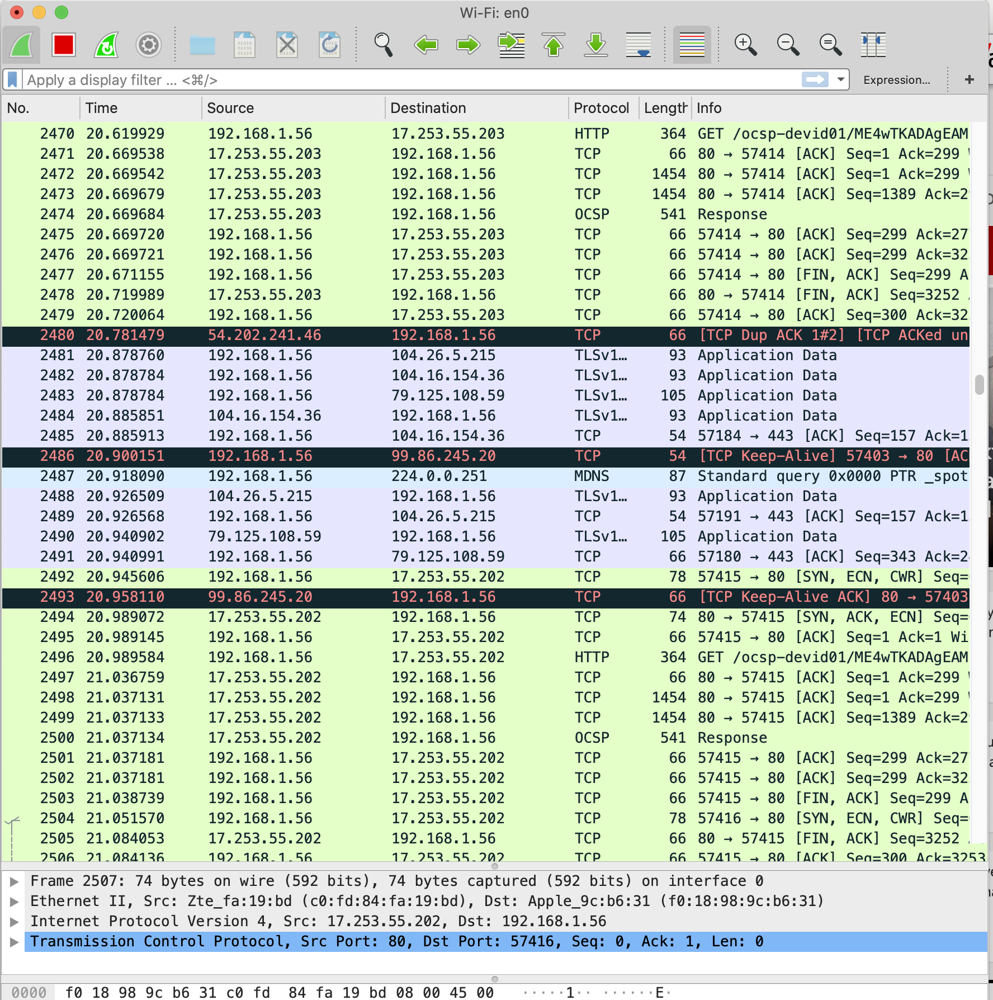

## Why VPN?

It is crucial to do not expose your personal details or not being attacked by someone when you are connected to public endpoints such as coffee, airport, hotel and guest WIFI points. Furthermore,  sometimes, people require to have organizatinal VPN access if organization itself does not provide one. For instance when students in universities have taken into consideration, it is quite important to reach resources that university is providing, it could be IEEE library access or enclosed resource which is only exclusive to internal network of the organization. 

No matter what is your intention to use VPN, it is quite useful to have in any case. 

There are lots of tutorials and explanations regarding to setting up WireGuard however I could not manage to find proper instructions for MacOSX users that's why I thought it could be useful to pack up in once in a post. I hope, this would be handy for anyone who are seeking for brand new tutorial for using WireGuard on MacOSx. 


Preliminary information; there is no such a concept of server and client in WireGuard, all devices are called as peers. However, in sake of understanding better, I will refer virtual private server as WireGuard server however, it is actually a PEER !  


## Prerequirement

Wireguard is a decent VPN solution with all recent crypto features compared to other open source VPN solutions furthermore, it is lightweight. 

Wireguard works based on key-pair relation between server and client just like ssh connection. The setup for personal usage is quite simple to do. Moreover, it is super fast, simple and more performant than any other open source VPN solution. Let's start build our own VPN solution using WireGuard. 

 - Prepare the environment to setup WireGuard 

 Following scenario is made on ubuntu 18.04, however almost for any linux distribution the steps are more or less same. 

- Virtual private server (VPS), cheapest VPS with ubuntu 18.04 could be enough to get your own personal VPN. It can be rented over ;

  - [Google Cloud](https://cloud.google.com/): Google provides $300 for 12 months for new comers to Google Cloud. 
  - [Amazon AWS](https://aws.amazon.com/): Amazon has some free tiers which could be suitable for running your own VPN solution. Check it out from their website.
  - [Digital Ocean](https://www.digitalocean.com/): Provides cheapest VPS on demand like $5 per month, which could be enough for personal VPN. Furthermore, you can claim $50 for Digital Ocean from [Github Students Package](https://education.github.com/pack/offers), if you have student account on Github. 
  - [Microsoft Azure](https://portal.azure.com/): If you have Github student account, you can take some advantages of Microsoft cloud services as well. Check it out from [Github Student Pack](https://education.github.com/pack/offers)


## Setup Peer 1 

- _[-Peer 1 is the Server, which will route all or some of your network traffic- ]_ 

I assumed that you have bought your VPS and ready to go for installation steps for WireGuard. Make sure that you have done with your SSH connection. 


```bash 
 $ sudo apt-get update && sudo apt-get upgrade -y 
 $ sudo add-apt-repository ppa:wireguard/wireguard
 $ sudo apt-get update 
 $ sudo apt-get install wireguard
```

Syncing Wireguard with kernel updates, which means that whenever there is an update for your linux kernel, wireguard module will be updated too.


```bash 
$ sudo modprobe wireguard
```

Afterwards, you can ensure that the module is loaded as following; 

```bash 
$ lsmod | grep wireguard

wireguard             217088  0
ip6_udp_tunnel         16384  1 wireguard
udp_tunnel             16384  1 wireguard
```

### Generate Keys 

Keys are backbone of WireGuard, extremely important step to take into. 

```bash 
$ cd /etc/wireguard
$ umask 077
$ wg genkey | sudo tee privatekey | wg pubkey | sudo tee publickey
```

After given commands above, you will have `publickey` and `privatekey` in `/etc/wireguard/` directory. 

### Setup Configuration

In this step, an interface should be defined in order to route all traffic from clients over rented VPS. Common interface for WireGuard is `wg0`. 

Create a configuration file on VPS as `/etc/wireguard/wg0.conf` through your favorite text editor (_vim_, _nano_, _vi_). 

```raw 
[Interface]
PrivateKey = <generated-private-key-here>
Address = 10.120.120.2/24
Address = fd86:ea04:1111::1/64
SaveConfig = true
PostUp = iptables -A FORWARD -i wg0 -j ACCEPT; iptables -t nat -A POSTROUTING -o ens3 -j MASQUERADE; ip6tables -A FORWARD -i wg0 -j ACCEPT; ip6tables -t nat -A POSTROUTING -o ens3 -j MASQUERADE
PostDown = iptables -D FORWARD -i wg0 -j ACCEPT; iptables -t nat -D POSTROUTING -o ens3 -j MASQUERADE; ip6tables -D FORWARD -i wg0 -j ACCEPT; ip6tables -t nat -D POSTROUTING -o ens3 -j MASQUERADE
ListenPort = 51820
```

- `ens3` is main network interface fo your server, if it is different change it with correct one, you can observe your by typing `ifconfig`.

-  `PrivateKey` is the key which was generated in [generate keys](#generate-keys) step. 


### Forward Traffic 

Traffic which comes into VPS should be forwarded properly, in order to set it up, change `/etc/sysctl.conf` file as follows. 

Using your text editor, add following two lines of configuration into `/etc/sysctl.conf`


```raw
net.ipv4.ip_forward=1
net.ipv6.conf.all.forwarding=1
```

After that, to activate them immeditaly, type; 

```bash 
$ sysctl -p
```

It is time to bring VPN interface up; 

```bash 
$ wg-quick up wg0
```

If there is no problem or complain when the command above called, you should be able to get following results from given command below.

```bash 
$ wg

interface: wg0
  public key: loZviZQpT5Sy4gFKEbk6Vc/rcJ3bH84L7TUj4qMB918=
  private key: (hidden)
  listening port: 51820
```

## Setup Peer 2 (-client-)

In my case, I will gonna go over for setup for MacOS client, however, the logic remains same for any other client that you will use. 

All required appliations are downloadable from given adress below. 

- [Applications for all distribution](https://www.wireguard.com/install/)

After installation of your application from given official website (https://www.wireguard.com/install/), it is time to add peers to server, and configure Peer 2 (client). 


### Setup Configuration (client)

If you are using MacOsX, you need to add following configuration under `/usr/local/etc/wireguard/wg0.conf`, however if you are using Linux, `/etc/wireguard/wg0.conf` would be correct place to put the configuration given below. 

```raw
[Interface]
Address = 10.120.120.2/32
Address = fd86:ea04:1111::2/128
# note that privatekey value is just a place holder 
PrivateKey = KIaLGPDJo6C1g891+swzfy4LkwQofR2q82pFR6BW9VM=
DNS = 1.1.1.1

[Peer]
PublicKey = <your server public key>
Endpoint = <your server public ip>:51820
AllowedIPs = 0.0.0.0/0, ::/0
```

If you have already installed GUI application from official installation website of WireGuard (https://www.wireguard.com/install/), it could be nice to arrange that configuration file as shown below. 


You will be able to create your configuration file through WireGuard GUI application as follows. 





Note that the `PrivateKey` value is just a placeholder, it is not valid value to put into, you need to take care of your own private key which is generated by WireGuard. 

- __PublicKey__ : This should be same with the public key when you have generated the keys on server in this [step](#generate-keys)
- __PrivateKey__: This is the key which is generated by WireGuard when you start to create new ocnfiguration tunnel from the applicaiton that you have installed from [official site](https://www.wireguard.com/install/).
- __EndPoint__: IP address or A record of your VPS. 


## Add Peer 

When you are done with setting up configuration in client side, you need to let your other peer (server) know your device. It can be achieved by following command on server. 

```bash 
$ wg set wg0 peer <client-public-key> allowed-ips 10.120.120.2/32,fd86:ea04:1111::2/128
```
- __client-public-key__: It is a placeholder, change it with your own public key which can be seen in your WireGuard application, e.g; it is shown in given figure above. 

When everything goes fine, you will be able to list peers by executing following command on server side. 

```bash 
$ wg

interface: wg0
  public key: loZviZQpT5Sy4gFKEbk6Vc/rcJ3bH84L7TUj4qMB918=
  private key: (hidden)
  listening port: 51820

peer: Ta9esbl7yvQJA/rMt5NqS25I/oeuTKbFHJu7oV5dbA4=
  allowed ips: 10.120.120.2/32, fd86:ea04:1111::2/128
```

Last but not least step is to up `wg0` interface on client side.(peer 2)

```bash 
$ wg-quick up wg0
```

Now you can check your IP address  location through [https://whatismyipaddress.com/](https://whatismyipaddress.com/)


## Firewall configuration 

It can be handy to enable `ufw` and allow port `51820/udp` for traffic routing. 

1. Check `ufw` status 

```bash 
$ ufw status verbose
```
2. If not enabled, enable it by ; (before enabling `ufw` make sure that you have already allowed port 22 otherwise you may face some problems in return)

 ```bash 
$ ufw enable 
```

3. Allow port `51820/udp` 

```bash 
$ ufw allow 51820/udp
```

Sometimes it is required to setup `iptables`, if that is the case use following rule. 

```bash 
$ iptables -A INPUT -p udp -m udp --dport 51820 -j ACCEPT
$ iptables -A OUTPUT -p udp -m udp --sport 51820 -j ACCEPT
```

__*Note: Run commands with a user which has root privileges*__ 


## How Traffic Looks Like

Following figures are just snippet of some network traffic which is captured by [WireShark](https://www.wireshark.org/). In the first figure, WireGuard is disabled, however in second image, WireGuard is enabled, you can easily distinguish the difference. 

__In ordinary usage (without VPN), your network traffic is seen as follows;__




__When you have configured your WireGuard to route all your traffic, here is how it is look like;__ 


It can be observed that all the traffic which goes out from client side has been encrypted with WireGuard. 

All in all, it is quite handy to have your own private VPN access which decreases the likelihood of being attacked. Apart from VPN capabilities of WireGuard, it stabilize WIFI connections and actually improves quality of WiFi connection on clients. Keep in mind that you need to create exclusive key pairs for each client who would like to route all or some of his/her traffic over VPN. 


## References

- [Quick Start Guide](https://www.wireguard.com/quickstart/)
- [Installation Guide](https://www.wireguard.com/install/)
- [Unofficial WireGuard Docs](https://github.com/pirate/wireguard-docs)
- [Performance](https://www.wireguard.com/performance/)
- [Limitation](https://www.wireguard.com/known-limitations/)
