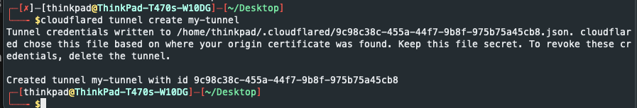

It is always been a fun to access a local machine which is running at your home or at university or somewhere which does not have a public IP address or you do not have control over the network. 

I already wrote a post about [cloudflare tunnelling](./cloudflare-tunneling.md) however it was about serving local web application. This time I will show you how to access local SSH service without exposing it to the world.


I was not thinking to write a post about this, however, before knowing cloudflare tunneling, I was considering to rent static IP address from my ISP. However, it costs some money and also in security point of view, it is not a good idea to expose your local machine to the world. ( somehow we do already but that's different topic :) )

## Prerequisites

- A domain managed by Cloudflare *(free tier is enough)*
  - You can checkout how to add your domain to cloudflare [here](https://developers.cloudflare.com/fundamentals/get-started/setup/add-site/)


## Steps to be followed on remote machine 

Once you have a domain managed by cloudflare, you can start to configure your remote machine. You need to install `cloudflared` cli. (**The machine that you want to access remotely through SSH**).

Installation and configuring clouflared tool is very well explained in Cloudlfare's [documentation](https://developers.cloudflare.com/cloudflare-one/connections/connect-apps/install-and-setup/installation).

Please follow the steps of configuring `cloudlfared` tool from the official documentation. 

When you are done with logging in and configuring `cloudflared` tool. You can create a tunnel to your local machine and configure it with SSH service. 

```bash
# create a tunnel
$ cloudflared tunnel create my-tunnel
```



You will get a tunnel ID. You will need this ID to configure your local machine.

Now you need to create a route to the tunnel. (The domain is the domain that you have added to cloudflare.)

```bash
# create a route
$ cloudflared tunnel route dns my-tunnel remote.mydomain.com
```

The SSH service or any other service can be configured from CLI however it will be ephemeral.

To make it persistent, you need to create a configuration file under `~/.cloudflared/config.yml`. 


```yaml
tunnel: my-tunnel
credentials-file: /home/awesomeuser/.cloudflared/credentials-file.json
url: ssh://localhost:22
```

You can find the full documentation [https://developers.cloudflare.com/cloudflare-one/connections/connect-apps/install-and-setup/tunnel-guide/local/local-management/configuration-file/](https://developers.cloudflare.com/cloudflare-one/connections/connect-apps/install-and-setup/tunnel-guide/local/local-management/configuration-file/).


Once you created configuration file (config.yml), then you can execute install command to serve your local SSH service through cloudflare tunnel. 


```bash
$ cloudflared --config ~/.cloudflared/config.yml tunnel  service install
```

Apart from tunneling, since we are exposing SSH service, it is a rule of thumb to use SSH keys instead of password.

```bash 
# change PasswordAuthentication value in /etc/ssh/sshd_config file and restart SSH service 
$ sudo sed -i 's/PasswordAuthentication yes/PasswordAuthentication no/g' /etc/ssh/sshd_config
$ sudo service ssh restart
```

These are the steps that you need to follow on the machine that you would like to access remotely through SSH.


## Steps to be followed on client machine 


Once you have configured your remote machine, you need to install `cloudflared` cli on your client machine too. (The machine which you use to access remote machine through SSH)

You can follow same installation instructions from [https://developers.cloudflare.com/cloudflare-one/connections/connect-apps/install-and-setup/installation](https://developers.cloudflare.com/cloudflare-one/connections/connect-apps/install-and-setup/installation).

On client side, you need to configure SSH for the host which uses cloudflare tunnel. 

Add the following lines to the file `~/.ssh/config`. 

```config
Host myhost 
  HostName remote.mydomain.com
  IdentityFile ~/.ssh/id_rsa
  ProxyCommand cloudflared access ssh --hostname %h
  User awesomeuser
```

I assumed that you already shared keys with your remote machine. 

If you did not, you can follow the steps from [https://www.digitalocean.com/community/tutorials/how-to-set-up-ssh-keys-on-ubuntu-1804](https://www.digitalocean.com/community/tutorials/how-to-set-up-ssh-keys-on-ubuntu-1804).

Additionally, please follow best practices for SSH configuration from [https://www.ibm.com/support/pages/best-practices-ssh-configuration)](https://www.ibm.com/support/pages/best-practices-ssh-configuration).

Now you can access your remote machine through SSH. 

```bash
$ ssh myhost
```

That's it. You can acccess your remote machine from anywhere in the world. No need to have a public IP address or move your machine with you when travelling. 


